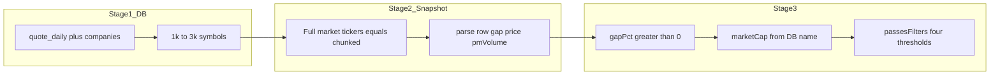

# Pre-market: DB universe + Full Market Snapshot (final plan)

**Status:** Finalized. Scope below is what implementation should match.

## Problem

[`fetchTopMarketMovers`](src/lib/massive.ts) uses top gainers/losers snapshot and is **capped at 20 tickers**. [`/api/premarket/movers`](src/app/api/premarket/movers/route.ts) cannot surface symbols outside that list.

## Final product rules

| Rule | Detail |
|------|--------|
| **Positive gaps only** | After parsing, **drop `gapPct <= 0`**. |
| **Stage 1 size** | **~1k–3k** symbols from SQL; default **`PREMARKET_SNAPSHOT_MAX_SYMBOLS` ≈ 3000**. |
| **Stage 2 API** | **[Full Market Snapshot](https://massive.com/docs/rest/stocks/snapshots/full-market-snapshot.md)** `GET /v2/snapshot/locale/us/markets/stocks/tickers` with **`tickers=`** comma list; **chunk** if URL too long. |
| **Scanner filters** | **`minPrice`**, **`minPmVolume`** (premarket session volume from snapshot), **`minGapPct`**, **`minMarketCap`** (from DB). Same as today’s [`passesFilters`](src/app/api/premarket/movers/route.ts). |
| **Average volume** | **Not used** in the scanner for this release: **do not** enrich from `getStockProfileDbMetrics` / `fetchProfile` for avg volume; set **`avgVolume1m`** and **`volRatioPct`** to **`null`** (or remove columns in UI—implementation choice). Parser does **not** need to persist `min.av` for product logic. |
| **Liquidity in SQL** | **`ORDER BY` avg volume / liquidity** may remain **only** to pick which symbols survive a **LIMIT** (truncation fairness). Not a user-facing filter. |

## Massive API (confirmed)

- **Full Market Snapshot:** `GET /v2/snapshot/locale/us/markets/stocks/tickers` with optional `tickers=AAPL,TSLA,...` (empty = all ~10k+). Same `tickers[]` object shape as movers ( `prevDay`, `day`, `lastTrade`, `lastQuote`, `min`, `todaysChangePerc` ).
- **Chunking** when query string too long; merge and dedupe by symbol.

## Architecture

## Implementation checklist

1. **`screener-db-native.ts`** — `getPremarketScanCandidates({ minMarketCap, minPrice, maxSymbols, date? })`.
2. **`massive.ts`** — `parseSnapshotTickerToPremarketRow` (price, prev close, gap %, pm volume from `day`/`min`/`lastTrade`/`lastQuote`); **`fetchStockSnapshotsForSymbolList`** with chunking.
3. **`premarket/movers/route.ts`** — Candidate list → snapshot → **`gapPct > 0`** → attach **market cap + name** from DB; **no avg-volume / vol-ratio fetch loop**; **`passesFilters`** unchanged; optional **`?source=movers`** debug.
4. **`PreMarketWorkspace.tsx`** — If table still shows avg vol / vol ratio columns, show **empty or dash** or remove column until a later release.

## Safeguards

URL chunking, `fetchWithRetry` on 429, `maxDuration` + **`meta`** (`candidateCount`, `snapshotTickerCount`, `chunkCount`, errors). Document stage-1 **price** as EOD proxy.

## Testing

Parser fixtures; API response **`movers` / `eligibleNow` / `filters`** stable; **`avgVolume1m` / `volRatioPct` null** acceptable for clients.

## Out of scope (later)

- Average volume, vol ratio, **fetchProfile** for volume.  
- WebSocket live stream.  
- Single-ticker fallback unless full-market fails on tier.
