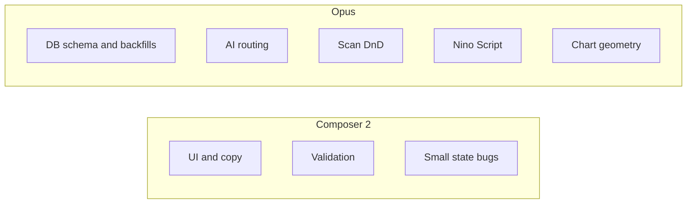

# Issue routing: Opus vs Composer 2

Source issues: [general_notes.md](../general_notes.md)

**Interpretation:** **Opus** = higher-capacity agent for ambiguous debugging, schema/pipeline work, cross-cutting features, and fragile UX (e.g. chart coordinates, drag-and-drop). **Composer 2** = faster agent for contained changes with clear acceptance criteria.

Cursor does not auto-assign models; use separate chats or sequential passes with the model you want.

---

## Assign to Opus (complex)

| Area | Issue | Why Opus |
|------|--------|----------|
| **AI Insights** | Insight “database vs web” incorrect; web-only fails; hybrid partial | Likely multiple code paths (prompt construction, tool routing, error handling). Needs end-to-end tracing, not a one-line fix. |
| **Left panel** | Scan drag: drop only on folder name, order within folder, visual cue when entering folder hierarchy | Reorder logic is split across [`WorkspaceHeader.tsx`](../src/components/WorkspaceHeader.tsx) and [`WatchlistPanel.tsx`](../src/components/WatchlistPanel.tsx) with HTML5 DnD; precise insert indices and nested lists are easy to get wrong. |
| **Lists** | New “Industries” list with Massive industries, columns for Industry RS (1M/3M/6M/12M) + % change, default sort 12M rank desc | New list type (or heavy column config), data join from profile/industry universe, default sort — product + data model. |
| **Right panel** | Missing market cap (e.g. DELL); ensure shares-based cap | Requires tracing profile/metrics sources (API vs DB) and fallbacks; may be data gap or display logic. |
| **Right panel** | Merge RS + Industry RS into one compact table; **remove 1W RS from DB**; only 1M/3M/6M/12M | Schema/migration, screener/API queries, UI in [`RightRail.tsx`](../src/components/RightRail.tsx) and related hooks — coordinated change set. |
| **Historical DB** | Gap analysis across symbols; examples AEHR/NBIS/SNDK; backfill to Q4 2025 / Q1 2026 | Operational + data audit; multiple ingest scripts and sources. |
| **Historical DB** | Quarterly revenue/EPS growth: **YoY** not sequential; recalc + backfill | [`scripts/refresh-financials.mjs`](../scripts/refresh-financials.mjs) currently pairs `row` with `prev = annual[j+1]/quarterly[j+1]` (sequential). Docs in [SCREENER-DATA-REFERENCE.md](./SCREENER-DATA-REFERENCE.md) describe YoY columns. [`useFundamentals.ts`](../src/hooks/useFundamentals.ts) also synthesizes growth from adjacent rows — align DB + UI + backfill. |
| **Historical DB** | Dollar volume on `daily_bars`; ADV 1M/3M on indicator table + backfill | Schema migrations, derived fields, refresh scripts, possibly screener exposure. |
| **Chart** | Measuring tool: second click places line in wrong position | Coordinate/transform bug in chart layer; needs careful reproduction and fix (often non-obvious). |
| **Ninscript** | Not working in New Scans (`P < 10`); thorough review / possible rebuild | Full stack in [`src/lib/nino-script/`](../src/lib/nino-script) + [`WatchlistPanel.tsx`](../src/components/WatchlistPanel.tsx) API params + [`src/app/api/screener/route.ts`](../src/app/api/screener/route.ts); language semantics and bar availability. |

---

## Assign to Composer 2 (simple)

| Area | Issue | Why Composer |
|------|--------|----------------|
| **General** | Extra **purple** flag (right of blue); update keyboard shortcut numbering (purple = 2) | Enum/colors + shortcut map in one or few components. |
| **AI Insights** | Explain how **lookback** is used in prompts | Explanation for you (not necessarily a site tooltip). |
| **Left panel** | Adding stock from scan via **+** sometimes switches to Lists section | Likely a stray `setSection` or shared handler; localized state fix. |
| **Left panel** | Scans dropdown hover: replace folder label clutter with **folder icon only** | Presentational change in dropdown row. |
| **Left panel** | **Off 52W high** column: color all red (price always below high) | Table cell styling rule. |
| **Right panel** | Annual vs quarterly tab: **stronger active** state | CSS/class tweak in [`RightRail.tsx`](../src/components/RightRail.tsx) (or tabs subcomponent). |
| **Chart** | Measure tool: remove **$** from change; format as **two rows** (% / change, then bars / days) | Label/layout only (split from misplaced-line bug to avoid Opus/Composer conflict in same file). |
| **Chart** | **Right-click** cancels in-progress drawing (measure, trend line) | Pointer handlers: clear active tool state. |
| **New scan filters** | **% off 52W high**: disallow negatives; min ≥ 0; clarify semantics in UI if needed | Input `min`/`max` validation + possibly filter clause guard in [`screener-db-native.ts`](../src/lib/screener-db-native.ts). |
| **New scan filters** | **New 52W High** checkbox | Add filter + SQL/subquery pattern consistent with existing screener filters (bounded scope if patterns exist). |

**Note on “New 52W High”:** If implementation requires novel window functions or new derived columns with no precedent, escalate to Opus; default here is Composer because it mirrors “add another filter.”

---

## Suggested workflow

1. Run **Composer 2** batches on the simple list (quick wins, low regression risk).
2. Run **Opus** on financials (YoY + backfill) and Ninscript first if scans/fundamentals are blocking other work.
3. Keep **chart measure positioning** on Opus; do **Composer** label tweaks in the same PR or immediately after to limit merge conflicts in the same component.

## Batch checklist (optional)

- [ ] **Composer 2:** flags/shortcuts, lookback explanation, + button section, folder icon, 52w column red, tab highlight, measure labels & right-click cancel, % off 52w validation, New 52W High filter
- [ ] **Opus — data:** financial gaps audit, YoY growth + backfill, dollar volume + ADV + backfill
- [ ] **Opus — product:** AI DB/web routing, Industries RS list, right panel RS merge + drop 1W RS + market cap
- [ ] **Opus — interaction:** scan folder DnD positioning, chart measure placement bug, Nino Script New Scans + review
